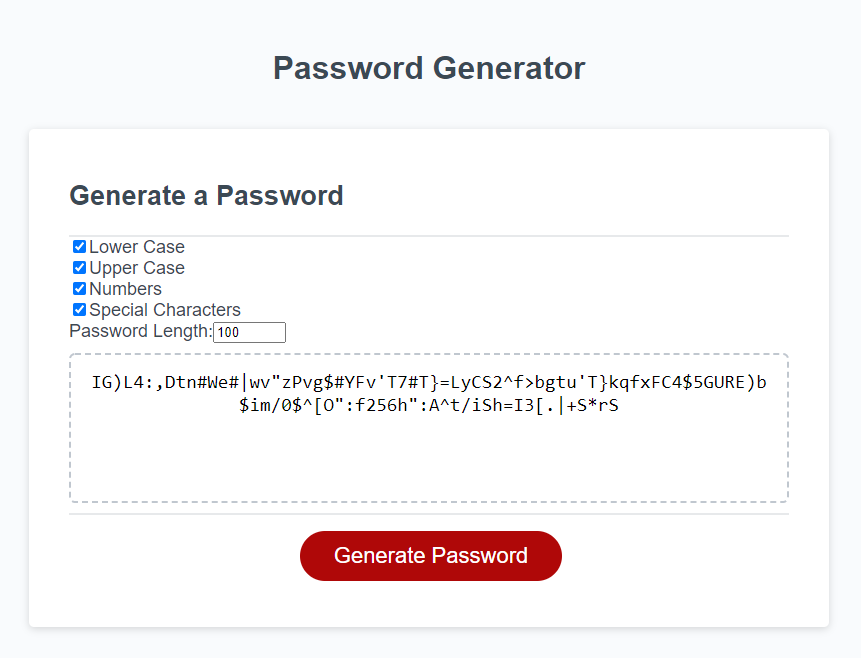

# Password Generator

## Description

Generate passwords quickly.

## Table of Contents

- [Password Generator](#password-generator)
  - [Description](#description)
  - [Table of Contents](#table-of-contents)
  - [Installation](#installation)
  - [Usage](#usage)
  - [Contributing](#contributing)
  - [Tests](#tests)
  - [Questions](#questions)
  - [License](#license)

## Installation

Run the index.html file in a web browser.

## Usage

Click on the "Generate Password" button and then select which charaters you want to include and the length.

## Contributing

Be courteous and contribute good code.

## Tests

Test thoroughly. Especially the buttons.

## Questions

Github Profile: [acotterson](https://github.com/acotterson)

If you have any additional questions, I can be reached at [acotterson@gmail.com](mailto:acotterson@gmail.com).

## License

Licensed under the Apache License, Version 2.0: [Apache](https://opensource.org/licenses/Apache-2.0)
